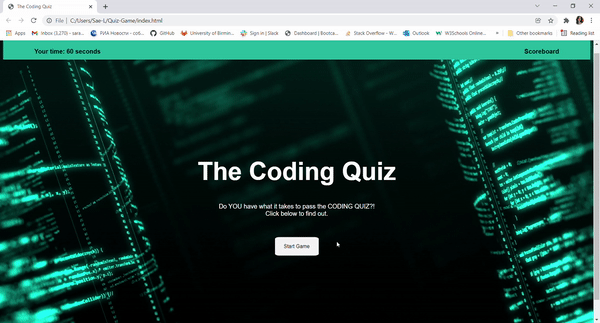

# 
 Coding Quiz Game 

  

 

  

Deployed site: https://languagebytes.github.io/Coding-Quiz-Game/

When the user clicks the start button, the game will be displayed on the screen. The game has 5 questions with 4 available answers to choose from. When a question is answered, the user will be then be shown a new question. In the corner is a timer, time will be deducted if the answer is incorrect. After the user has answered all 5 questions, they will be prompted to enter their name and save their highscore. They will then be able to view the highscores on a separate page.

## 
 Fixing a bug in Local Storage 

There is currently a bug in the localStorage, I will work on solving this in the coming weeks :).

